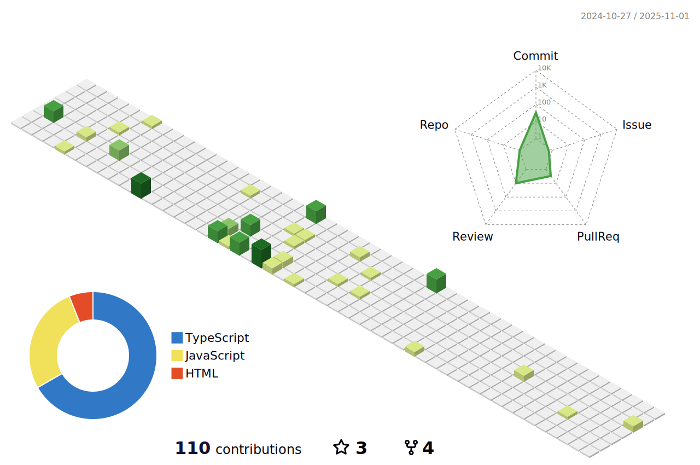

# Hi there 👋

I'm a software architect and Front-End developer based in Leipzig.

📚 I’m currently working on my own projects, developing skills in Front-End technologies and learning more about UI/UX design.

🤓 I like to challenge myself, learn new things and help people to discover wonderful world of tech.

🔊 I believe in a power of communication and speak 2 languages: German and English.

Follow my journey 🚀

 

